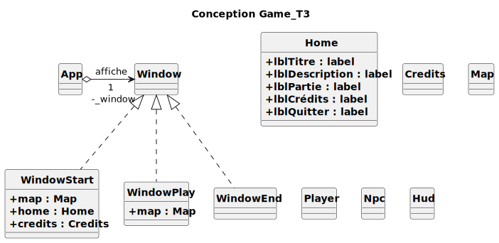

# Document de travail T4

## Description des objectifs pédagogiques du jeu
**Objectif pédagogique général**

Ce que le joueur doit apprendre, en une seule phrase la plus courte possible.

- ***Comment les habitants d’Amboise et leurs rois cohabitaient dans un contexte économique et social, durant la période de 1450-1574, et de quelle manière leur vie a-t-elle pu être retranscrite ?***

**Description des objectifs pédagogiques**

Le joueur doit intégrer la manière dont les habitants d’Amboise pouvaient devenir des nobles, cet objectif est le fil rouge du jeu, de par ce dernier le joueur comprendra l’objectif pédagogique général.

Il doit comprendre que c’est grâce à la manière de vivre des habitants, leurs actes tout au long de leur vie, leur rang social , qu’on peut retracer l’histoire au travers d’archives, au travers de leurs contrats, accords ou signatures.

Le jeu se concentre sur le fait d’apprendre la façon dont vivaient les amboisiens.

Par ailleurs, malgré les opportunités des habitants, ces derniers peuvent mourir à tout moment d’une mort déconvenue.

**Apprendre la vie des habitants d’Amboises**

- Un Amboisien du Tiers-Etat peut avoir pratiqué un métier dans une palette très large, tel que chaussetiers, ou barbier par exemple, qui peuvent mener ou non à des opportunités d'ascension sociale.

**Comprendre comment sont récupérées les informations historiques**

- Malgré ce que l’on peut penser, les traces écrites de notre passé ne sont pas forcément extravagantes. Dans le cas d’Amboise, la plupart des informations locales tel que les différentes familles leur engagement politique dans la ville, sont répertoriés dans des documents en apparence anodins ; comme des documents administratifs, des titres de propriétés ou même de simples signatures.

## Description du jeu

- **Type de jeu** : Jeu d’aventure
- **Incarnation du joueur** : *Un citoyen du tiers-état d’Amboise*

**Déroulement d’une partie**

Description du déroulement d’une partie : début, déroulement et fin

- Début : L’avatar du joueur apparaît sur une map, il découvre qu’il est citoyen d'une magnifique ville et qu’il a l’opportunité de faire des rencontres (de parler à des PNJ (Personnage non-joueur) ).
- Déroulement : Le joueur se balade et parle à des PNJ, il accepte ou refuse les propositions qu’ils ont ou non à offrir afin d’évoluer dans le jeu. 

3 étapes/scènes de jeu

- Scène/Tour 1 : des PNJ offrent des opportunités en rapport avec le métier du joueur qui lui permettent d’accéder à la scène suivante, d’augmenter ses revenus, de jouer avec eux, ou seulement de discuter.
- Scène 2 : à partir d’ici, des PNJ peuvent permettre de faire du joueur ce qu’il souhaite être (moine, noble) ou de faire ce qu’il souhaites faire (gagner de l’argent, devenir ami du roi)
- Scène 3 : dernière scène, le résultat est fixé : en parlant à des PNJ le joueur découvre vers quel résultat il est amené et l’écran de fin s’affiche à un après avoir parler à un PNJ ou lorsque le joueur meurt de vieillesse (lorsqu’il a passé trop de temps dans le jeu).
- Fin : Ecran de fin
  - Partie gagnante si le joueur est devenu **NOBLE**, 
  - partie perdante si au bout de 2min de partie le joueur meurt de vieillesse.

**Modèle conceptuel applicatif**

Liste, MCD ou diagramme de classe décrivant le jeu, et en particulier les entités, en séparant ce qui est exposé au joueur de ce qui est interne au jeu.

- Notre code de Diagramme de Classe se trouve dans notre dépôt GIT. [Diagramme de Classe](https://git.unistra.fr/auskour/t3-mod-23-b/-/blob/main/Conception/Game.puml?ref_type=heads)

## Description des fonctionnalités 

**Actions du joueur**

### Liste des actions possibles par le joueur. Peut être organisé en module.

***Gestion des phases de jeu***

- **Entreprendre** une conversation avec un PNJ
- **Accepter** le choix/l’opportunité offert par le PNJ et passer à la scène/au tour suivant
- **Fermer** le parchemin récapitulant la transaction faite
- **Recommencer** une partie

**Informations au joueur**

### Liste des informations présentées au joueurs. Peut être organisé en module.

***Gestion du temps***

- ***Toutes les 2,5 secondes l'habitant gagne 1 an, il meurt arrivé à un certain âge. +Cet âge est visible.***

***Gestion de l’argent***

- ***Le  revenu du joueur est disponible***

**Moteur interne**

### Liste des interactions entre les actions du joueurs et les informations

***Gestion des tours***

- *Accepter l’offre d’un PNJ peut permettre le passage à la phase suivante selon l’offre du PNJ*

## Scénarios

***Exemple de déroulement gagnant le plus rapide :*** 

1. *Naître en étant le fils du roi*

*[Objectif : devenir noble]*

2. *Marier la princesse*

*[Objectif : devenir noble]*

3. *Travailler pour le roi*

*[Objectif : devenir noble]*

4. *Le joueur accumule suffisamment de prestige*

*[Objectif : devenir noble]*

5. *Le joueur gagne suffisamment d'argent, en accomplissant des quêtes, et achète son titre de noblesse* 

*[Objectif : devenir noble]*

***Exemples de déroulement perdant :***

1. *Naître en étant une femme, à la Renaissance, en étant une femme vous aviez comme seules solutions pour être noble de l'être soit par naissance, soit par alliance*

*[Objectif : devenir noble]*

2. *Être trop vieux, prendre trop de temps à s'élever dans la société*

*[Objectif : devenir noble]*