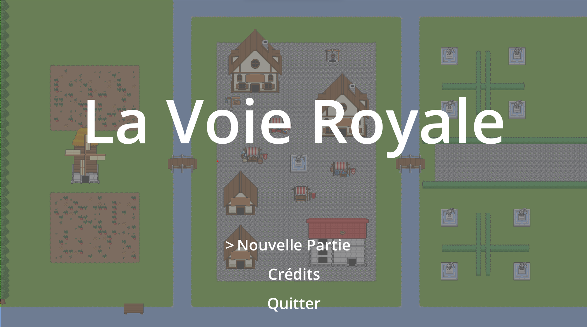
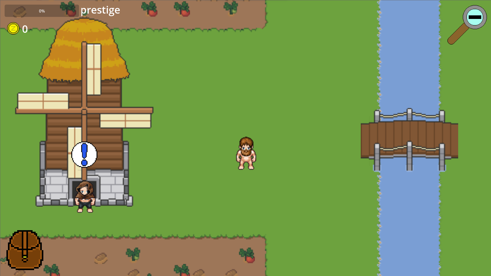
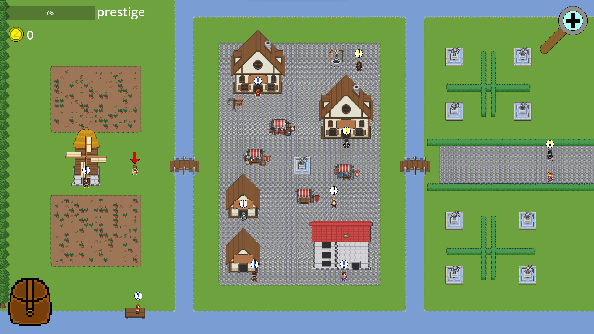
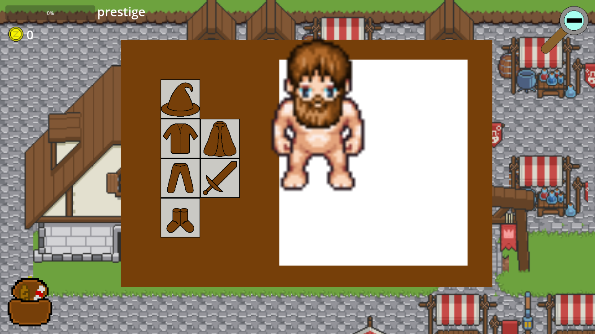
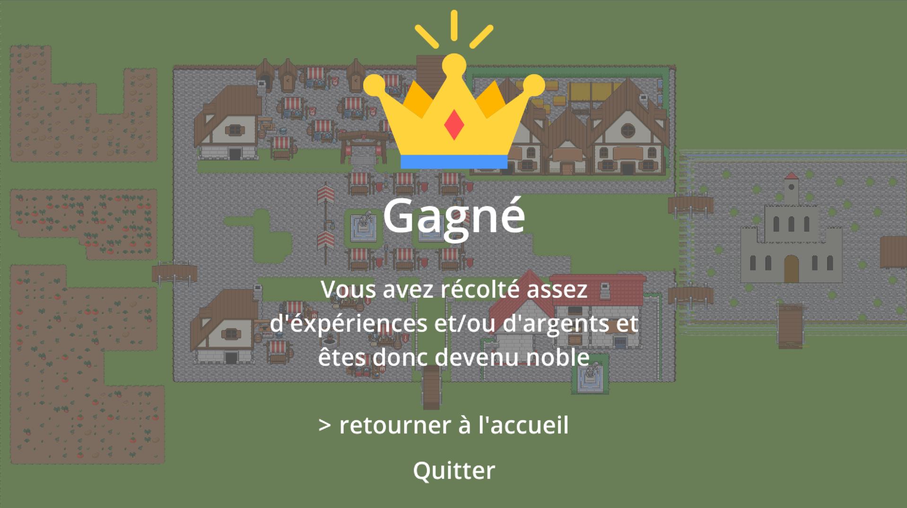
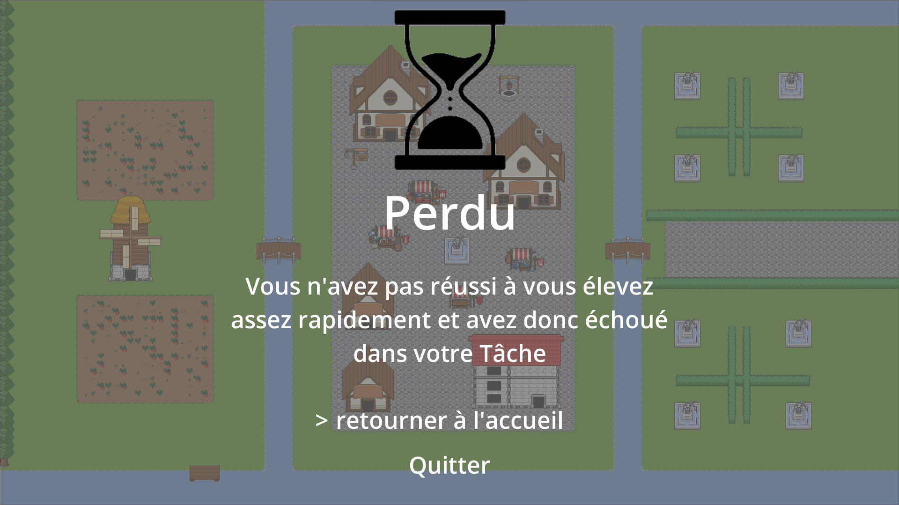

# T3 - La Voie Royale

- Nom du groupe : AUSKOUR
- Nom du jeu : La Voie Royale
- Membres du groupe :
    - Mathieu ACKERMANN
    - Henri HARTZ
    - Simon GUILLORET

## Présentation du projet

### Sujet
Habitants et manants d'Amboise, histoire sociale et économique entre les Amboisiens et leurs rois à la Renaissance jusqu'au début des Guerres de religion (1450-1574)

### Contexte du scénario
De par son statut particulier et unique, Amboise était une ville remplie d’opportunités pour s’élever socialement et obtenir des seigneuries, voire des titres de noblesse.
Certains achetaient des seigneuries, et, s’ils étaient assez riches, cessent de travailler.
On pouvait aussi essayer de s’attirer les bonnes grâces des nobles et notables de la ville, tel que le maire ou le bailli (représentant de la justice royale), en leur offrant des cadeaux, pécuniaires ou matériels, notamment en échange de titres et de terres. Une stratégie similaire consistait à se marier avec les filles de nobles, dans l’espoir d’hériter de leur titre.

### Résumé rapide du jeu
On débute la partie en tant qu'habitant Amboisien du tiers-état. L'objectif du jeu est de devenir noble avant la fin de la partie. Pour cela, il faut commencer à acquérir des titres en rentrant en contact avec des nobles ou des gens d'une classe sociale plus modeste. Vous allez côtoyer des nobles et des individus des autres castes. C’est grâce à vos différentes actions que vous allez monter en titre et en grade dans la ville tout en cherchant à faire fortune. C’est un jeu de choix. On peut gagner en réussissant à devenir noble en achetant un titre avec de l’argent et/ou en se mariant avec une fille noble et payant sa dote.

## Procédure d'installation et d'exécution
### Sous windows
- Effectuez un *git clone* de [__Game__](https://git.unistra.fr/auskour/t3-mod-23-b/-/tree/main/Game?ref_type=heads)
- Rendez-vous dans le dossier Release
- Exécutez *LaVoieRoyale - Setup.exe* en double cliquant dessus

### *En cours de développement*
### Sous Linux
- Effectuez un *git clone* de [__Game__](https://git.unistra.fr/auskour/t3-mod-23-b/-/tree/main/Game?ref_type=heads)
- Entrez les commandes suivante dans un terminal :
    - cd Release
    - chmod 777 *LaVoieRoyale.x86_64*
    - *./LaVoieRoyale.x86_64*

## Captures d'écran

## Liens utiles:
- [Le cahier des charges](https://docs.google.com/document/d/1kBEbKzOqdxH2LaxdPOYSaSH5yMCf-24NimNT3ag3_nw/edit?usp=sharing)
- [Le google sheet du T3](https://docs.google.com/spreadsheets/d/1ObAhKdszRl0_Bh1YLE9KecVansGJnkslSzq5-qT76nM/edit?usp=sharing)
